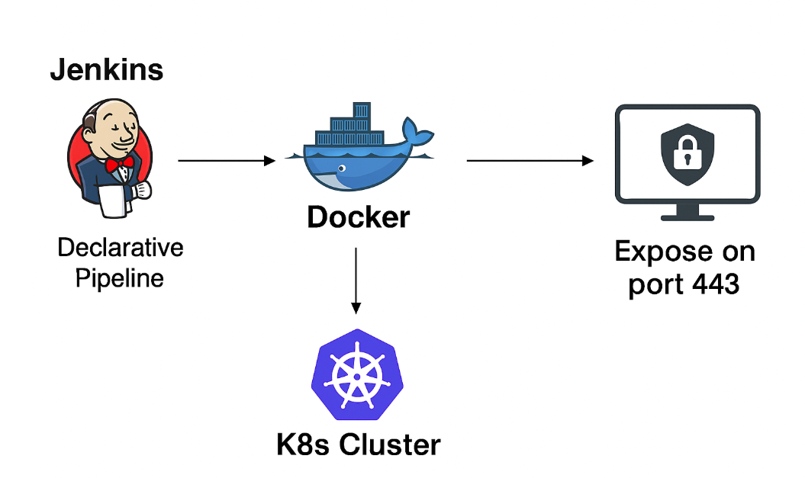

# Kubernetes Application Deployment with Terragrunt, ArgoCD, and GitHub Actions

This repository contains both application code and deployment tools used to manage applications running on Kubernetes clusters.  
It integrates infrastructure provisioning, GitOps synchronization, and CI/CD automation using a unified workflow.  

## Repository Contents

- Application source code
- Helm charts for Kubernetes deployments
- jenkins for active workflow
- Terragrunt/Terraform configuration for provisioning AWS infrastructure

**code info**:
This is a Flask web application for managing second-hand clothes. It uses Flask-SQLAlchemy to connect to a PostgreSQL database and store user accounts (User) and product listings (AddClothe). Users can sign up, log in, add products with images, and delete their own products. Images are stored in S3, and URLs are generated with a presigned link for secure access.
The app retrieves sensitive information, like the database password, from AWS Secrets Manager using boto3, which is the AWS SDK for Python. Botocore is a lower-level library used internally by boto3 to handle requests, responses, and error handling with AWS services. Together, they allow the Flask app to securely interact with AWS services, such as S3 for image storage and Secrets Manager for fetching credentials, without hardcoding secrets in the code.
Environment variables are used for configuration, including AWS region, database connection details, and secret keys, making the app flexible for local development, Docker, or deployment in Kubernetes.

**why do i have db_dumps in my code?**:
**Migration to PostgreSQL**
I wanted all the pods in my cluster to be able to access a single, centralized database instead of relying on a local database on each node. So, I decided to move my data to PostgreSQL in the cloud using AWS RDS.
First, I created a PostgreSQL database in RDS, picked a recent version with Multi-AZ deployment, set up a username and password, enabled public access, and saved the database endpoint.
Next, I installed the psycopg2 driver in Flask and updated the connection string in my code to point to the RDS database instead of the local one.
Then, I exported only the data I needed from MySQL into an SQL dump and imported it into PostgreSQL using psql, loading it into the cloud database.
Now, all the pods in the cluster can access the database remotely, without depending on a local database.
Why PostgreSQL (RDS) instead of PVCs or node storage?
1. I/O limitations – Regular Kubernetes volumes don’t always handle high read/write throughput well, especially when many pods access them at the same time.
2. Availability across AZs – PVCs or PVs are usually tied to a single node or availability zone, so pods in other zones might not access them reliably. RDS with Multi-AZ solves this.
3. Scalability and durability – A managed cloud database takes care of failures, backups, replication, and maintenance automatically, which is much harder to handle manually with PVs/PVCs.
4. Best practice – When consistency, performance, and reliability matter, using a managed database service like RDS is much better than relying on local node storage.

**other alternative to postgress**:
1. Block storage volumes (EBS/PVCs) – I could have stored the database directly on a persistent volume backed by block storage. This would give a dedicated storage space for the database, but it’s tied to a single node or AZ, which makes it harder for pods in other zones to access it reliably. I/O performance could also become a bottleneck if many pods are reading/writing simultaneously.

2. S3 or object storage – I could have stored the database dump or snapshots in S3. This works for backups or static storage, but it’s not suitable as a live, transactional database, since S3 doesn’t support SQL queries or frequent read/write operations efficiently.
3. Exporting to MySQL or RDS Aurora – I could have replicated the data into a MySQL database or used Aurora. This can work, but the migration and schema adaptation would have been more complicated. Aurora is scalable and highly available like RDS Postgres, but since my app already depends on PostgreSQL-specific features, this would have added extra complexity.
4. PV + containerized PostgreSQL – I could have taken the SQL dump I created from MySQL via SQLAlchemy and loaded it into a PostgreSQL instance running inside a pod, using a temporary folder or persistent volume. This would allow me to test or migrate the database without immediately using RDS. However, I would still be responsible for managing backups, replication, failover, and availability across multiple AZs, which is much harder to handle manually compared to using a managed service like RDS.

**jenkins Process**
After installing Jenkins in the Kubernetes cluster using the Helm chart, Jenkins runs as a Deployment with a LoadBalancer Service that exposes the UI. Once deployed, you can access the Jenkins dashboard via the external IP provided by the LoadBalancer: kubectl get svc -n jenkins
logging in with the admin credentials configured in the Helm chart:
Jenkins → Manage Jenkins → Credentials → Global → Add Credentials + adding dockerhub-credentials (username=docker-username, password=docker-password).
From there, you create a new Pipeline job and configure it to use either a Jenkinsfile from SCM (GitHub) or a pipeline script directly.
then execute the pipeline stages, which in your case include checking out the code, building a Docker image, pushing it to Docker Hub, and deploying the application to the EKS cluster via Helm. Proper configuration of credentials for Docker Hub and access to Kubernetes (kubectl + Helm installed in the Jenkins environment) is required to ensure the pipeline runs successfully.

**Final Result:**
The backend Flask app is now updated inside the EKS Prod environment.
 

**running the jenkinsfile: steps**
1. make sure you add the credentials to cluster for Docker-Hub actions:
you can just run this command:
kubectl create secret docker-registry dockerhub-credentials   --docker-username=noa10203040   --docker-password=<password> -n jenkins
2. open the ui of jenkins and put the pipeline in the block where mentioned - pipeline script.
3. wait for response (either success or failed)
4. check the pod to see if it's running:
kubectl get pods -n prod
5. check the alb attached address (which attached to port :80 , 443), by runnig this command:
kubectl get ingress -n prod
6. view the website as you wish!
here is a live pic of the web:

## Visualization

Inside my Kubernetes cluster, Jenkins runs as a pod (or set of pods) that acts as the CI/CD automation engine. Jenkins is deployed on the cluster using a Helm chart or Kubernetes manifests, which automatically create the Jenkins controller, persistent storage, service, and a Kubernetes agent template. Because Jenkins runs directly in the cluster, every pipeline step can use Kubernetes agents: when the pipeline starts, Jenkins dynamically creates a temporary pod that executes the build steps, and once the job completes, the pod is removed.

The pipeline itself follows three main stages. First, Jenkins pulls the application’s source code from GitHub. Next, it builds a Docker image of my Python (or any language) application using a Docker, and then pushes the image to a Docker registry (like Docker Hub or ECR). Finally, Jenkins deploys the application into the cluster by applying Kubernetes manifests or Helm charts: this creates a Pod running your app. The pod is then exposed to the outside world on port 443 using either a Kubernetes Service of type LoadBalancer or an Ingress controller with TLS termination.

