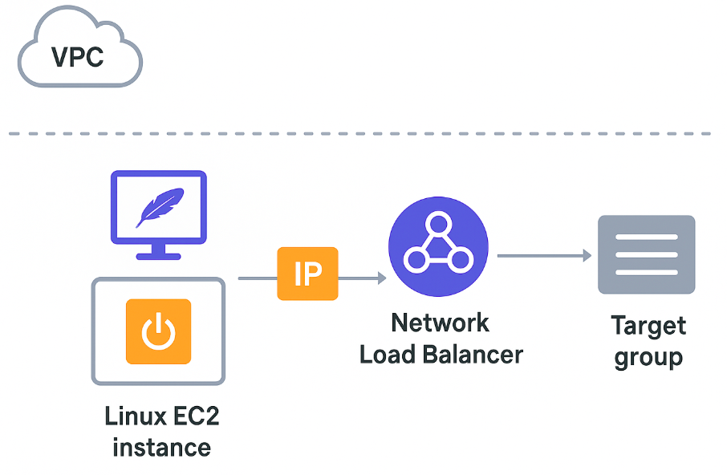

**short explaination**
This Terraform configuration creates a Linux-based EC2 instance in the default VPC, installs Apache automatically, and opens port 80 only for a specific IP address (the Leumi proxy). 
The instance receives an Elastic IP so it always has a fixed public address.
In addition, the configuration deploys a Network Load Balancer (NLB) across all subnets in the VPC. A target group is created to route TCP traffic on port 80, and the EC2 instance is registered as a target inside that group.
Finally, a listener on the NLB listens on port 80 and forwards all incoming traffic to the target group, which then sends it to the EC2 instance.

**visualisation**:
