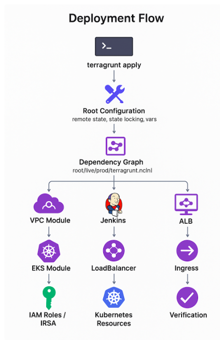

## Deployment Flow

### 1. Provision Infrastructure and Deploy Applications

Run the following command from the Terragrunt root directory:

terragrunt apply

This will create all infrastructure components and deploy all applications across environments.

**Deployment Process (Step-by-Step)**:
When I run terragrunt apply + init, Terragrunt orchestrates the deployment of all resources in my environment according to the dependency graph defined in the configuration.

- Root Configuration (root.hcl)
Terragrunt first loads the global configuration, including remote state backend (S3), state locking (DynamoDB), and shared variables. At this stage, no actual resources are created - it only sets up where state will be stored.

- providers.tf:
Terraform collects all required_providers from:
The root module
All child modules (recursively)
Terraform downloads and installs the providers locally (in .terraform/plugins/).
This is important: it doesn’t install anything on AWS, Kubernetes, or Helm itself.
It just makes the plugins available for Terraform to talk to the remote systems.
**Before applying any resources, Terraform ensures:**
All required providers are installed
Correct versions are used
Modules then use these providers:
If i try to apply a module that needs a provider (like Kubernetes or Helm) without the system knowing this providers exists and ready to install them, Terraform will fail
This prevents you from “running on a cluster without the provider configured”
**Terraform forces you to declare providers first, ensuring that no module runs against a system (AWS, Kubernetes, Helm, etc.) before Terraform has the necessary plugin ready.**

Make them available to all modules that reference them
- Environment-Specific Config (root/live/prod/terragrunt.hcl)
Terragrunt scans the environment folder and builds a dependency graph between modules. Each module knows which outputs from other modules it requires. Providers (AWS, Kubernetes, Helm) are initialized, and module sources are downloaded.

- **VPC Module**
  
The VPC module runs first to create the networking layer: VPC, subnets (public/private), route tables, IGW, NAT Gateway, and security groups. Its outputs (VPC ID, subnet IDs) are required by other modules like EKS.

- **EKS Module**
  
The EKS module waits for VPC outputs, then creates the EKS cluster (control plane), managed node groups, and add-ons. Kubernetes and Helm providers are initialized only after the cluster endpoint and token are available (data.aws_eks_cluster_auth).

- **IAM Roles / IRSA**
  
IAM policies and IRSA roles are created next. Each pod that needs AWS permissions (e.g., S3 access, Load Balancer management) gets a dedicated IAM role linked to a ServiceAccount. These roles depend on the cluster’s OIDC provider and cannot be fully attached until the cluster is active.

- **Kubernetes Resources**
  
Namespaces and ServiceAccounts are created in the cluster. Helm charts that require these ServiceAccounts (like the AWS Load Balancer Controller) are installed afterward so that the pods get the correct AWS permissions via IRSA.

- **Completion**
  
Once all modules are applied in the correct order, I verify the deployment with commands like kubectl get nodes, kubectl get pods -A, helm list -n kube-system, and terragrunt output-all.

**more info about the proccess of irsa + oidc + boto3 + alb**:
When you create an EKS cluster with enable_irsa = true, an OIDC provider is automatically created. This allows pods to obtain temporary AWS credentials without using static access keys.
Each pod that requires specific permissions is associated with a custom IAM role. For example:
If pods need to access Secrets Manager or S3, you create an IAM role with the appropriate policy.
If pods need to manage a Load Balancer, you create a different IAM role with the required permissions.
The IAM role is then linked to a ServiceAccount, and each ServiceAccount is assigned to one pod or a group of pods. Once a pod uses that ServiceAccount, it can operate under the permissions defined in the IAM role through OIDC.
In the case of the Flask app, the code inside the pod uses boto3 – the AWS SDK for Python – which allows the pod to perform actions in AWS, such as creating an S3 bucket or retrieving secrets. All of this is done under the permissions provided by the IAM role linked to the ServiceAccount.
Additionally, system pods running in the kube-system namespace, such as the ALB Ingress Controller, watch for Ingress resources like ingress.yaml. When an Ingress resource is applied, the ALB controller automatically provisions an Application Load Balancer (ALB) and updates the DNS/endpoint. This ensures that external traffic can reach the correct service in the cluster using the ALB address.
This setup ensures that permissions and pods are securely and centrally managed through OIDC and IRSA, while traffic is properly routed through the ALB managed by the ingress controller.

**acm + port 443 requests:**
In this configuration, i generated a secure RSA private key and use it to create a fully self-sufficient TLS certificate through Terraform. The certificate includes defined subject details and is configured with the appropriate key usages required for strong HTTPS communication, such as server authentication, digital signatures, and key encipherment. then, i imported this certificate into AWS ACM, enabling it to be used by AWS services that terminate SSL/TLS traffic on port 443. The lifecycle rule ensures smooth rotation by creating a new certificate before the previous one is replaced, resulting in a clean, reliable, and automation-driven approach to managing HTTPS certificates within my infrastructure.

**Jenkins Deployment and CI/CD**:
Jenkins is deployed via Helm as a LoadBalancer service in the cluster. It acts as the Continuous Integration / Continuous Deployment (CI/CD) engine for my applications. Jenkins connects to my GitHub repositories, builds Docker images, pushes them to the container registry, and triggers Helm deployments to my EKS cluster. The Jenkins pod runs inside Kubernetes and can optionally use a ServiceAccount if AWS access is required. Its LoadBalancer service provides a public URL for accessing the Jenkins UI.
**This command is meant to update your kubeconfig file (usually ~/.kube/config) so that you can connect to your EKS cluster using kubectl:**
aws eks update-kubeconfig --name prod-eks-cluster --region us-east-1

**Post-Deployment Verification**

**Verify Cluster Health and Workloads**:
kubectl get nodes
kubectl get pods -A

**Verify Load Balancer Address**:
kubectl get ingress -n prod

**visualisation**:

